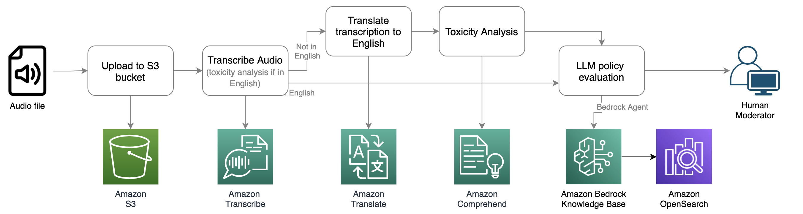
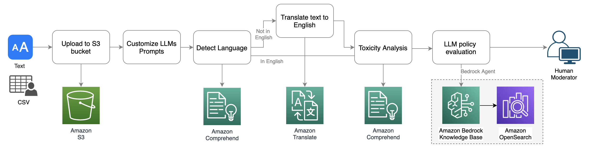

# Moderate audio and text chats using AWS AI services and LLMs

Online gaming and social communities offer voice and text chat functionality for their users to communicate. Although voice and text chat often supports friendly banter and trash talking, it can also lead to problems such as hate speech, cyberbullying, harassment, and scams. Today, many companies rely solely on human moderators to review toxic content. However, verifying violations in chat is time-consuming, error-prone, and challenging to scale.

This repository contains two sample demos showcasing audio and text moderation using AWS AI services and Generative AI. Each demo includes a sandbox page that allows you to upload an audio or text file to initiate the analysis. After uploading, you can review the analysis results in the 'Sample' tab and explore the architecture design in the 'Workflow' tab.

### Audio moderation workflow
An audio moderation workflow could be initiated by a user reporting other users on a gaming platform for policy violations such as profanity, hate speech, or harassment. This represents a passive approach to audio moderation. A human moderator receives the report and must spend time investigating the conversation to determine if it violates platform policy. Alternatively, the workflow could be triggered proactively. For instance, in a social audio chat room, the system could record all conversations and apply analysis with low latency. Both passive and proactive approaches can trigger the pipeline below for audio analysis.



### Text moderation workflow
The text chat moderation workflow follows a similar pattern to audio moderation, but it utilizes Amazon Comprehend Toxicity Analysis, which is tailored for text moderation. The sample app supports an interface for uploading bulk text files in CSV or TXT format and provides a single-message interface for quick testing.



## Prerequisites
- You'll require an IAM role or user with access to AWS services including S3, Transcribe, Comprehend, Translate, and Bedrock.
- In Amazon Bedrock, make sure you have access to the LLMs. Refer to [this instruction](https://catalog.workshops.aws/building-with-amazon-bedrock/en-US/prerequisites/bedrock-setup) for detail.
- This demo leverages Amazon Bedrock Knowledge Base as a managed-RAG for policy evaluation with LLMs. To run the demo, create a Knowledge Base in the AWS Console and upload your trust and safety policies. Then, set the environment varaible `BEDROCK_KNOWLEDGE_BASE_ID` value with the Knowledge Base ID you've generated. To set up Bedrock Knowledge Base, refer to [this instruction](https://aws.amazon.com/blogs/aws/knowledge-bases-now-delivers-fully-managed-rag-experience-in-amazon-bedrock/).

## Start the app
### Clone source code to your local drive
```
git clone https://github.com/aws-samples/aws-genai-audio-text-chat-moderation
cd aws-genai-audio-text-chat-moderation
```
### Create Python Virtual Environment
```
python3 -m venv .venv
source .venv/bin/activate
```
### Install dependencies
```
pip install -r requirements.txt
```
### Setup environment variables
Configure the below environment variables:
```
export AWS_BUCKET_NAME=YOUR_S3_BUCKET_NAME
export BEDROCK_KNOWLEDGE_BASE_ID=YOUR_KNOWLEDGE_BASE_ID

export AWS_REGION=AWS_REGION (Optional. Default value: us-east-1)
export AWS_S3_PREFIX=YOUR_S3_PREFIX (Optional. Default value: policy-eval-demo)
```
Set up the following environment variables if you wish to enable Cognito User Pool for user login. The application will ignore login if you leave them null.
```
export COGNITIO_POOL_ID=YOUR_COGNITIO_USER_POOL_ID
export COGNITIO_APP_CLIENT_ID=YOUR_COGNITIO_APP_CLIENT_ID
```

### Start the streamlit app
```
streamlit run Home.py
